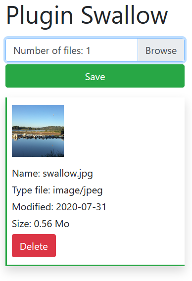

# SWALLOW - File upload plugin for all screen sizes
## Simplified file upload plugin built in "jQuery" and "Bootstrap 4". This uses the "FormData" constructor of javascript in order to ensure the management ranging from one to several files as well as the functions made available to you. A preview step also allows you to control or delete one or more files.

<p align="center">
  
</p>

## Languages ​​used:
- html
- Javascript
- php 

## Framework used:
- jQuery
- Boostrap 4

**Requires minimum or higher loading of the following versions:**

    <!-- jQuery -->
    <script src="https:- ajax.googleapis.com/ajax/libs/jquery/3.5.1/jquery.min.js"></script>
    <script src="https:- cdn.jsdelivr.net/npm/popper.js@1.16.1/dist/umd/popper.min.js"></script>

    <!-- Bootstrap 4 -->
    <script src="https:- stackpath.bootstrapcdn.com/bootstrap/4.5.2/js/bootstrap.min.js"></script>   
    <link rel="stylesheet" href="https:- stackpath.bootstrapcdn.com/bootstrap/4.5.2/css/bootstrap.min.css">

    <!-- Swallow V1 -->
    <script src="js/swallow.js"></script>    

## Plugin initialization

>You can find an example accessible from the "index.html" page

```javascript
    $(function() {
        $("#example").swallow({
            //Options...
        })
    })  
```

>Or if you want to incorporate it into a custom tree structure

```javascript
    $(function() {
        $("#example").swallow({
            phpPath             : "asset/plugin-swallow-master/php/",
            imgPath             : "asset/plugin-swallow-master/img/"
            //Options...
        })
    })  
```
> Html side

```html
<div class="container mt-3">

    <h1>Plugin Swallow</h1>

    <div class="mt-3">
        <div id="example"></div>            
    </div>

</div> 
```

## Available options:  

**Directory path**

| Options | Type | Content |
| :---         |     :---:      |     :---:      |
| imgpath             : "img/" | String | Contains images of different file types |
| phppath             : "php/" | String |  Php script which allows the loading of files |

**Backup directory of selected files**

>The files are automatically saved under the "nest /" directory which is automatically created when the Swallow plugin is initialized. The path or the name can be modified.

| Options | Type | Content |
| :---         |     :---:      |     :---:      |
| targetpath          : "nest/" | String |  File destination directory | 

**Server information**
>Automatically limited to data supplied by the server or otherwise you can manually force the value only in bytes. You can also fill in your own values ​​in bytes !

| Options | type | Example of a byte value |
| :---         |     :---:      |     :---:      |
| maxFileSize         : "" | Integer | 5000000 or 5000 * 1000|
| maxFileCount        : "" | Integer| 20 or 2 * 10 |

**Using a personal directory**

>Force option swallowTag to true. The second option contains a default tag assigned when opening the plugin which can also be personalized for the name of the subdirectory (Spaces, accents or special characters are not allowed).

| Options | Type | Content |
| :---         |     :---:      |     :---:      |
| swallowTag          : true | boolean |  By default false |  
| targetTag           : "NamePerso" | String |  Do not add a backslash and accent at the end of the chain |  

```javascript
/*Example :*/
$("#example").swallow({
    swallowTag          : true,   
    targetTag           : "NamePerso"
})
``` 

**List of accepted file types**

| Options | Type | Restrict file types |
| :---         |     :---:      |     :---:      |
| acceptFiles         : "*"  | String |  By default any type of file |

```javascript
/*Example :*/
$("#example").swallow({ 
        acceptFiles:"application/msword,text/csv,image/jpeg"
    })
``` 
**You can also reduce the image quality to compress the size on formats (png, jpeg, jpeg, gif).**

>This value is by default at 100.

| Options | Type | Values accept |
| :---         |     :---:      |     :---:      |
| maxImgQuality          : 100 | Integer | 0 to 100 |

```javascript
/*Example :*/
$("#example").swallow({ 
        maxImgQuality: 50
    })
``` 

**The image that will appear by default if the file type is unknown**

>In the "img" folder, find an image collection that associates with files that you can replace by keeping the name of the original file.

| Options | Type | Wording possible |
| :---         |     :---:      |     :---:      |
| defaultImg          : "file.png" | String | True |

**Choose the language you want by redefining the labels**

| Options | Type | Wording possible |
| :---         |     :---:      |     :---:      |
| labelInput1         : "Add your files" | String | True |
| labelInput2         : "Number of files" | String | True |
| labelType           : "Type file" | String | True |
| labelModified       : "Modified" |  String |True |
| labelSize           : "Size" | String | True |
| labelSaveBtn        : "Save" | String | True |
| labelDeleteBtn      : "Delete" | String | True |
| labelLoadingBtn     : "Loading.." | String | True |
| labelSuccess        : "File upload successful" | String | True |
| labelAcceptFiles    : "Accepted formats" | String | True |
| labelMaxFileSize    : "Max size accept" | String | True |
| labelMaxFileCount   : "Max files accept" | String | True |
| labelAllDenied      : "Denied !" | String | True |

**Functions of callback**

> "response" is a string in return

```javascript
/*Example :*/
    $("#example").swallow({ 
        onSuccess : function (response, statut){
            console.log(response);
        },
        onError : function (response, statut, erreur){
            console.log(erreur);
        }
    })
``` 

## Licenses
- Bootstrap is released under the MIT license and is copyright 2020 Twitter
- jQuery [MIT license](https:tldrlegal.com/license/mit-license)

